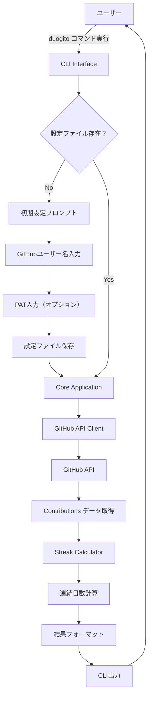
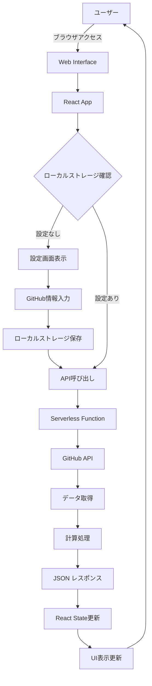
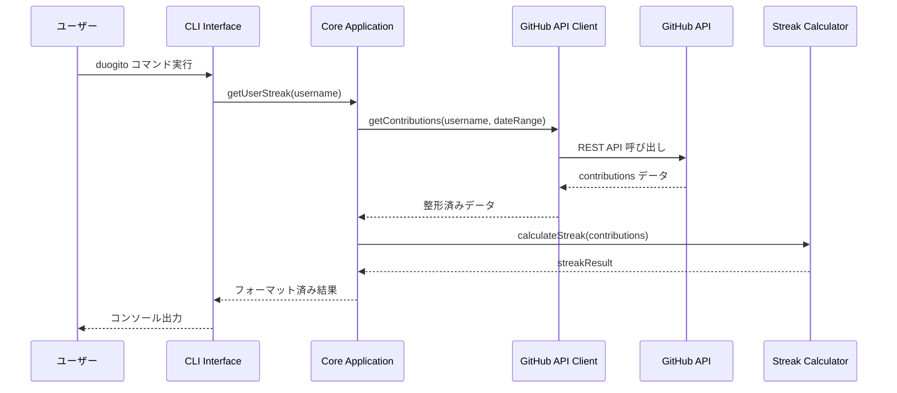
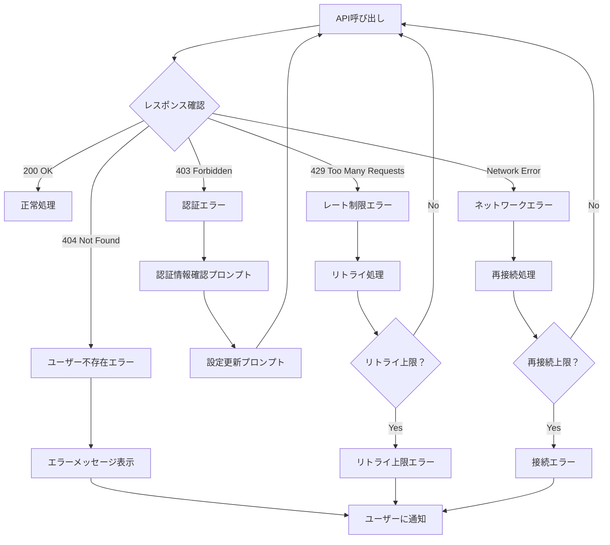
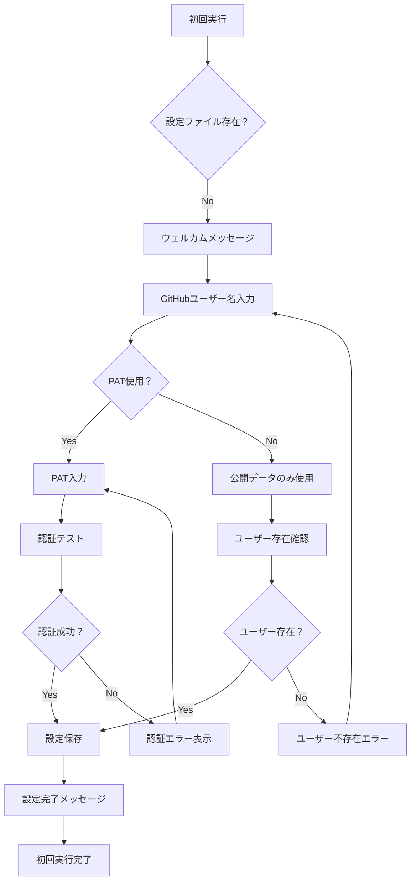
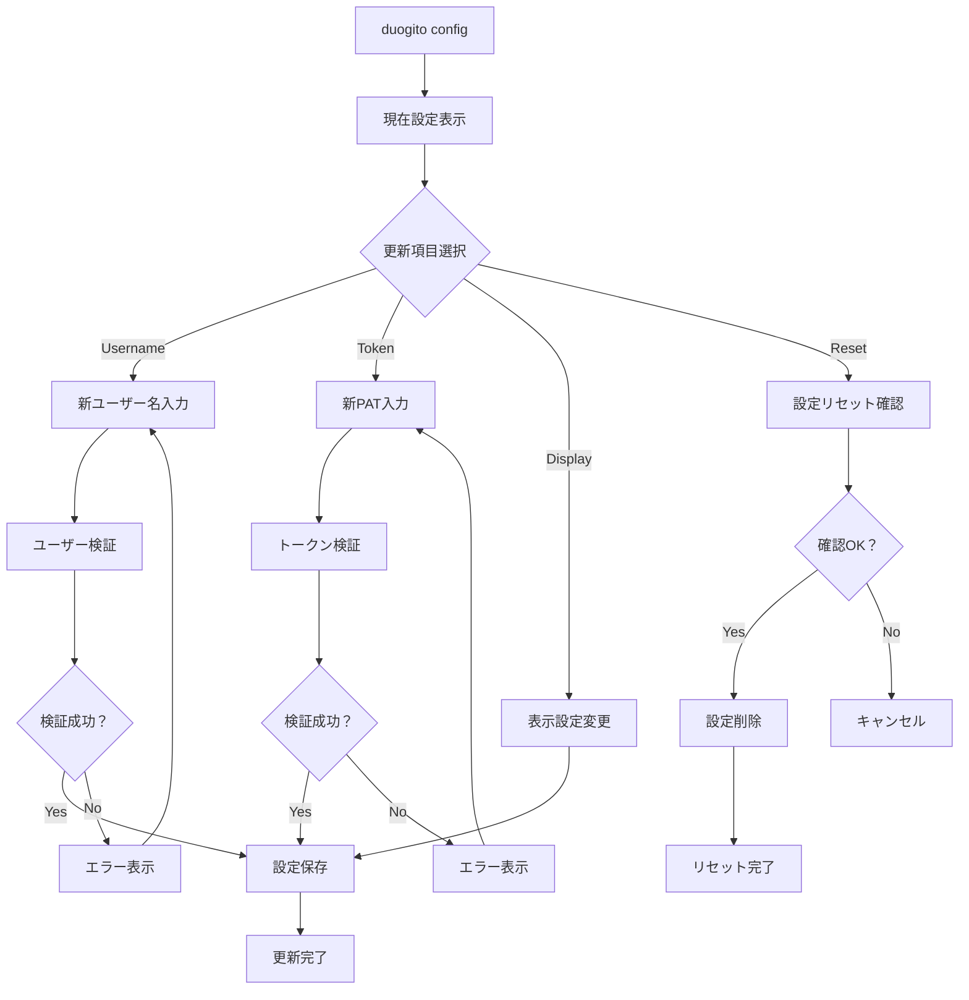
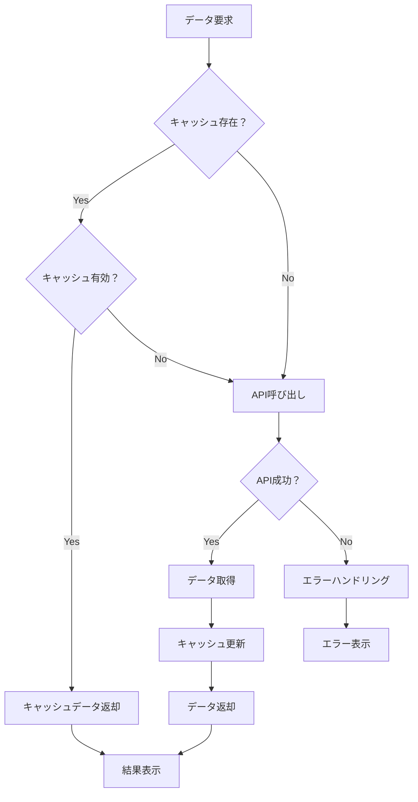

# データフロー図

## ユーザーインタラクションフロー

### CLI版の基本フロー

```mermaid
flowchart TD
    A[ユーザー] -->|duogito コマンド実行| B[CLI Interface]
    B --> C{設定ファイル存在？}
    C -->|No| D[初期設定プロンプト]
    D --> E[GitHubユーザー名入力]
    E --> F[PAT入力（オプション）]
    F --> G[設定ファイル保存]
    G --> H[Core Application]
    C -->|Yes| H[Core Application]
    H --> I[GitHub API Client]
    I --> J[GitHub API]
    J --> K[Contributions データ取得]
    K --> L[Streak Calculator]
    L --> M[連続日数計算]
    M --> N[結果フォーマット]
    N --> O[CLI出力]
    O --> A
```

### Web版の基本フロー（将来実装）

```mermaid
flowchart TD
    A[ユーザー] -->|ブラウザアクセス| B[Web Interface]
    B --> C[React App]
    C --> D{ローカルストレージ確認}
    D -->|設定なし| E[設定画面表示]
    E --> F[GitHub情報入力]
    F --> G[ローカルストレージ保存]
    G --> H[API呼び出し]
    D -->|設定あり| H[API呼び出し]
    H --> I[Serverless Function]
    I --> J[GitHub API]
    J --> K[データ取得]
    K --> L[計算処理]
    L --> M[JSON レスポンス]
    M --> N[React State更新]
    N --> O[UI表示更新]
    O --> A
```

## データ処理フロー

### 連続日数計算のシーケンス

```mermaid
sequenceDiagram
    participant U as ユーザー
    participant CLI as CLI Interface
    participant Core as Core Application
    participant API as GitHub API Client
    participant GH as GitHub API
    participant Calc as Streak Calculator
    
    U->>CLI: duogito コマンド実行
    CLI->>Core: getUserStreak(username)
    Core->>API: getContributions(username, dateRange)
    API->>GH: REST API 呼び出し
    GH-->>API: contributions データ
    API-->>Core: 整形済みデータ
    Core->>Calc: calculateStreak(contributions)
    Calc-->>Core: streakResult
    Core-->>CLI: フォーマット済み結果
    CLI-->>U: コンソール出力
```

### エラーハンドリングフロー

```mermaid
flowchart TD
    A[API呼び出し] --> B{レスポンス確認}
    B -->|200 OK| C[正常処理]
    B -->|404 Not Found| D[ユーザー不存在エラー]
    B -->|403 Forbidden| E[認証エラー]
    B -->|429 Too Many Requests| F[レート制限エラー]
    B -->|Network Error| G[ネットワークエラー]
    
    D --> H[エラーメッセージ表示]
    E --> I[認証情報確認プロンプト]
    F --> J[リトライ処理]
    G --> K[再接続処理]
    
    H --> L[ユーザーに通知]
    I --> M[設定更新プロンプト]
    J --> N{リトライ上限？}
    K --> O{再接続上限？}
    
    N -->|No| A
    N -->|Yes| P[リトライ上限エラー]
    O -->|No| A
    O -->|Yes| Q[接続エラー]
    
    M --> A
    P --> L
    Q --> L
```

## 設定管理フロー

### 初回セットアップ

```mermaid
flowchart TD
    A[初回実行] --> B{設定ファイル存在？}
    B -->|No| C[ウェルカムメッセージ]
    C --> D[GitHubユーザー名入力]
    D --> E{PAT使用？}
    E -->|Yes| F[PAT入力]
    E -->|No| G[公開データのみ使用]
    F --> H[認証テスト]
    G --> I[ユーザー存在確認]
    H --> J{認証成功？}
    I --> K{ユーザー存在？}
    J -->|Yes| L[設定保存]
    J -->|No| M[認証エラー表示]
    K -->|Yes| L[設定保存]
    K -->|No| N[ユーザー不存在エラー]
    M --> F
    N --> D
    L --> O[設定完了メッセージ]
    O --> P[初回実行完了]
```

### 設定更新フロー

```mermaid
flowchart TD
    A[duogito config] --> B[現在設定表示]
    B --> C{更新項目選択}
    C -->|Username| D[新ユーザー名入力]
    C -->|Token| E[新PAT入力]
    C -->|Display| F[表示設定変更]
    C -->|Reset| G[設定リセット確認]
    
    D --> H[ユーザー検証]
    E --> I[トークン検証]
    F --> J[設定保存]
    G --> K{確認OK？}
    
    H --> L{検証成功？}
    I --> M{検証成功？}
    K -->|Yes| N[設定削除]
    K -->|No| O[キャンセル]
    
    L -->|Yes| J
    L -->|No| P[エラー表示]
    M -->|Yes| J
    M -->|No| Q[エラー表示]
    
    J --> R[更新完了]
    N --> S[リセット完了]
    P --> D
    Q --> E
```

## キャッシュフロー（オプション機能）

### キャッシュ戦略

```mermaid
flowchart TD
    A[データ要求] --> B{キャッシュ存在？}
    B -->|Yes| C{キャッシュ有効？}
    B -->|No| D[API呼び出し]
    C -->|Yes| E[キャッシュデータ返却]
    C -->|No| D[API呼び出し]
    D --> F{API成功？}
    F -->|Yes| G[データ取得]
    F -->|No| H[エラーハンドリング]
    G --> I[キャッシュ更新]
    I --> J[データ返却]
    E --> K[結果表示]
    J --> K[結果表示]
    H --> L[エラー表示]
```