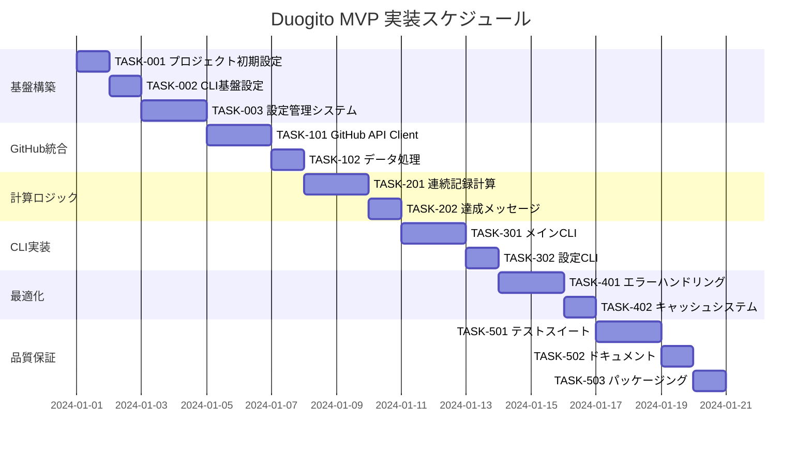

# Duogito MVP 実装タスク

## 概要

全タスク数: 22
推定作業時間: 35-40時間
クリティカルパス: TASK-001 → TASK-002 → TASK-101 → TASK-102 → TASK-201 → TASK-301

## タスク一覧

### フェーズ1: 基盤構築

#### TASK-001: プロジェクト初期設定

- [x] **タスク完了**
- **タスクタイプ**: DIRECT
- **要件リンク**: 全体アーキテクチャ
- **依存タスク**: なし
- **実装詳細**:
  - package.json作成（pnpmエコシステム対応）
  - TypeScript設定（tsconfig.json）
  - ESLint + Prettier設定
  - ディレクトリ構造作成（src/, tests/, dist/）
  - mise設定の確認・更新
- **テスト要件**:
  - [x] TypeScriptコンパイルテスト
  - [x] ESLint設定検証
- **完了条件**:
  - [x] pnpm install が正常実行される
  - [x] TypeScriptコンパイルが成功する
  - [x] リント・フォーマットが動作する

#### TASK-002: CLI基盤設定

- [x] **タスク完了**
- **タスクタイプ**: DIRECT
- **要件リンク**: REQ-005（CLI形式で実行）
- **依存タスク**: TASK-001
- **実装詳細**:
  - Commander.jsの導入・設定
  - 基本的なCLIコマンド構造の実装
  - bin設定（package.json）
  - コマンドヘルプテキスト
- **テスト要件**:
  - [x] CLI起動テスト
  - [x] ヘルプコマンドテスト
- **完了条件**:
  - [x] `duogito --help` が動作する
  - [x] `duogito --version` が動作する

#### TASK-003: 設定管理システム

- [ ] **タスク完了**
- **タスクタイプ**: TDD
- **要件リンク**: REQ-201（初回実行時の設定）、REQ-303（設定ファイル保存）
- **依存タスク**: TASK-002
- **実装詳細**:
  - ConfigServiceの実装
  - ~/.duogito/config.json の読み書き
  - 設定スキーマの検証
  - デフォルト設定の管理
- **テスト要件**:
  - [ ] 単体テスト: ConfigService全メソッド
  - [ ] 統合テスト: 設定ファイル読み書き
  - [ ] エラーテスト: 不正な設定ファイル
- **完了条件**:
  - [ ] 設定の読み込み・保存・検証が動作する
  - [ ] 存在しないファイル時のデフォルト動作

### フェーズ2: GitHub API統合

#### TASK-101: GitHub API Client実装

- [ ] **タスク完了**
- **タスクタイプ**: TDD
- **要件リンク**: REQ-002（GitHub API使用）、REQ-401（利用規約遵守）
- **依存タスク**: TASK-003
- **実装詳細**:
  - GitHubServiceインターフェースの実装
  - REST API呼び出し（axios/fetch）
  - レート制限の処理
  - 認証（PAT）の管理
- **テスト要件**:
  - [ ] 単体テスト: API呼び出しロジック
  - [ ] 統合テスト: GitHub API との通信
  - [ ] モックテスト: エラーレスポンス処理
- **エラーハンドリング**:
  - [ ] 404 User Not Found
  - [ ] 403 Rate Limit Exceeded
  - [ ] ネットワークエラー
- **完了条件**:
  - [ ] ユーザー情報取得
  - [ ] コントリビューションデータ取得
  - [ ] 適切なエラーハンドリング

#### TASK-102: Contributions データ処理

- [ ] **タスク完了**
- **タスクタイプ**: TDD
- **要件リンク**: REQ-002（contributionsデータ取得）
- **依存タスク**: TASK-101
- **実装詳細**:
  - GitHub API レスポンスの正規化
  - ContributionDay配列への変換
  - GraphQL API対応準備
  - 日付範囲指定機能
- **テスト要件**:
  - [ ] 単体テスト: データ変換ロジック
  - [ ] 統合テスト: 実際のAPIデータ処理
  - [ ] 境界値テスト: 空データ、大量データ
- **完了条件**:
  - [ ] 一貫したデータ形式での出力
  - [ ] 異なるAPI形式への対応

### フェーズ3: 連続記録計算

#### TASK-201: 連続記録計算アルゴリズム

- [ ] **タスク完了**
- **タスクタイプ**: TDD
- **要件リンク**: REQ-003（連続日数計算）
- **依存タスク**: TASK-102
- **実装詳細**:
  - StreakCalculatorServiceの実装
  - 連続日数の計算ロジック
  - 最長記録の追跡
  - 日付の境界処理（タイムゾーン考慮）
- **テスト要件**:
  - [ ] 単体テスト: 計算ロジック全パターン
  - [ ] エッジケーステスト: 連続0日、1日、長期間
  - [ ] 日付境界テスト: 月またぎ、年またぎ
- **UI/UX要件**:
  - [ ] 計算進捗の表示（大量データ時）
- **完了条件**:
  - [ ] 正確な連続日数計算
  - [ ] 各種エッジケースへの対応

#### TASK-202: 達成メッセージシステム

- [ ] **タスク完了**
- **タスクタイプ**: TDD
- **要件リンク**: REQ-202（励ましメッセージ）、REQ-203（達成メッセージ）
- **依存タスク**: TASK-201
- **実装詳細**:
  - メッセージ生成ロジック
  - 日本語・英語対応
  - マイルストーン判定（7日、30日、100日等）
  - カスタマイズ可能なメッセージ
- **テスト要件**:
  - [ ] 単体テスト: メッセージ生成
  - [ ] 多言語テスト: 日本語・英語
  - [ ] 境界値テスト: マイルストーン前後
- **完了条件**:
  - [ ] 適切なメッセージ表示
  - [ ] 多言語対応

### フェーズ4: CLI実装

#### TASK-301: メインCLIコマンド実装

- [ ] **タスク完了**
- **タスクタイプ**: TDD  
- **要件リンク**: REQ-004（結果表示）、REQ-001（ユーザ名受け取り）
- **依存タスク**: TASK-202
- **実装詳細**:
  - `duogito` コマンド（デフォルト動作）
  - `duogito check <username>` コマンド
  - 出力フォーマット（テキスト・JSON）
  - 色付き出力（ターミナル対応）
- **テスト要件**:
  - [ ] コマンドテスト: 全パターン
  - [ ] 出力フォーマットテスト
  - [ ] E2Eテスト: 実際のワークフロー
- **UI/UX要件**:
  - [ ] ローディング状態: プログレスバー・スピナー
  - [ ] エラー表示: 日本語エラーメッセージ
  - [ ] アクセシビリティ: スクリーンリーダー対応
- **完了条件**:
  - [ ] 基本的なstreak表示機能
  - [ ] ユーザビリティの確保

#### TASK-302: 設定CLIコマンド実装

- [ ] **タスク完了**
- **タスクタイプ**: TDD
- **要件リンク**: REQ-201（初回設定）
- **依存タスク**: TASK-301
- **実装詳細**:
  - `duogito config` コマンド
  - 初回セットアップウィザード
  - 設定値の表示・変更
  - 設定リセット機能
- **テスト要件**:
  - [ ] インタラクティブテスト: プロンプト動作
  - [ ] 設定更新テスト
  - [ ] リセット機能テスト
- **UI/UX要件**:
  - [ ] ユーザーフレンドリーなプロンプト
  - [ ] 設定値の検証とフィードバック
- **完了条件**:
  - [ ] 完全な設定管理機能
  - [ ] 初回ユーザー体験の最適化

### フェーズ5: エラーハンドリング・最適化

#### TASK-401: 包括的エラーハンドリング

- [ ] **タスク完了**
- **タスクタイプ**: TDD
- **要件リンク**: REQ-101〜104（条件付き要件）、NFR-202（日本語エラーメッセージ）
- **依存タスク**: TASK-302
- **実装詳細**:
  - カスタムエラークラス
  - エラーメッセージの国際化
  - リトライ機構
  - 詳細ログ機能
- **テスト要件**:
  - [ ] エラーケーステスト: 全エラータイプ
  - [ ] リトライ機構テスト
  - [ ] ログ出力テスト
- **エラーハンドリング**:
  - [ ] GitHub API エラー
  - [ ] ネットワークエラー
  - [ ] 設定ファイルエラー
  - [ ] 入力検証エラー
- **完了条件**:
  - [ ] 全エラーケースの適切な処理
  - [ ] ユーザーフレンドリーなエラーメッセージ

#### TASK-402: キャッシュシステム（オプション）

- [ ] **タスク完了**
- **タスクタイプ**: TDD
- **要件リンク**: NFR-002（API呼び出し最小化）
- **依存タスク**: TASK-401
- **実装詳細**:
  - CacheServiceの実装
  - ローカルファイルキャッシュ
  - TTL（Time To Live）管理
  - キャッシュサイズ制限
- **テスト要件**:
  - [ ] キャッシュ基本機能テスト
  - [ ] TTL動作テスト
  - [ ] サイズ制限テスト
- **UI/UX要件**:
  - [ ] キャッシュ状態の表示
  - [ ] キャッシュクリア機能
- **完了条件**:
  - [ ] 効率的なキャッシュ機構
  - [ ] パフォーマンス向上の確認

### フェーズ6: 品質保証・パッケージング

#### TASK-501: テストスイート完成

- [ ] **タスク完了**
- **タスクタイプ**: TDD
- **要件リンク**: 全要件（品質保証）
- **依存タスク**: TASK-402
- **実装詳細**:
  - Jest設定の最適化
  - カバレッジレポート
  - E2Eテストの追加
  - CI/CD準備
- **テスト要件**:
  - [ ] ユニットテストカバレッジ > 80%
  - [ ] 統合テストカバレッジ > 70%
  - [ ] E2Eテスト: 主要ワークフロー
- **完了条件**:
  - [ ] 全テストパス
  - [ ] 十分なテストカバレッジ

#### TASK-502: ドキュメント作成

- [ ] **タスク完了**
- **タスクタイプ**: DIRECT
- **要件リンク**: NFR-201（技術知識不要で使用可能）
- **依存タスク**: TASK-501
- **実装詳細**:
  - README.md作成
  - 使用方法ガイド
  - トラブルシューティング
  - 開発者向けドキュメント
- **完了条件**:
  - [ ] 完全なユーザーガイド
  - [ ] 技術仕様書

#### TASK-503: パッケージング・配布準備

- [ ] **タスク完了**
- **タスクタイプ**: DIRECT
- **要件リンク**: アーキテクチャ（npm package配布）
- **依存タスク**: TASK-502
- **実装詳細**:
  - package.json最終調整
  - ビルドスクリプト
  - npm公開準備
  - バージョニング戦略
- **テスト要件**:
  - [ ] ビルドテスト
  - [ ] パッケージ動作テスト
- **完了条件**:
  - [ ] 配布可能なパッケージ
  - [ ] インストール・実行確認

## 実行順序

## 並行実行可能なタスク群

### グループA（フェーズ2後）:
- TASK-201（連続記録計算）
- TASK-202（達成メッセージ）

### グループB（フェーズ4後）:
- TASK-401（エラーハンドリング）
- TASK-402（キャッシュシステム）

### グループC（フェーズ5後）:
- TASK-501（テストスイート）
- TASK-502（ドキュメント）

## クリティカルパス分析

**主要パス**: TASK-001 → TASK-002 → TASK-003 → TASK-101 → TASK-102 → TASK-201 → TASK-301 → TASK-501 → TASK-503

**推定所要時間**: 18日間（1日=2-3時間作業として）

## 成功指標

### 機能テスト
- [ ] 有効なGitHubユーザー名で正しい連続日数が表示される
- [ ] 無効なユーザー名でエラーメッセージが表示される  
- [ ] コントリビューションがないユーザーで0日が表示される
- [ ] ネットワークエラー時に適切なエラーハンドリングが動作する
- [ ] 初回実行時にユーザー名入力が求められる
- [ ] 連続記録が途切れた場合に正しく0からカウントされる

### 非機能テスト
- [ ] レスポンス時間が5秒以内
- [ ] GitHub APIレート制限に適切に対応
- [ ] エラーメッセージが日本語で表示される
- [ ] 結果が視覚的に分かりやすく表示される

### ユーザビリティテスト
- [ ] 技術的知識のないユーザーが説明書なしで使用できる
- [ ] 実行コマンドが直感的で覚えやすい
- [ ] 結果画面が一目で理解できる

## リスク管理

### 高リスク項目
1. **GitHub API制限**: レート制限への対応策
2. **日付計算**: タイムゾーン・夏時間の考慮
3. **大量データ**: 長期利用ユーザーのパフォーマンス

### 軽減策
1. 適切なキャッシュ戦略とリトライ機構
2. 日付ライブラリ（date-fns）の活用
3. データ処理の最適化とプログレス表示